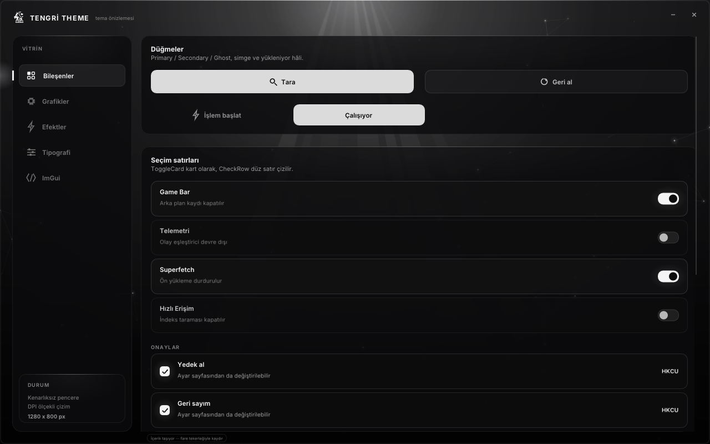
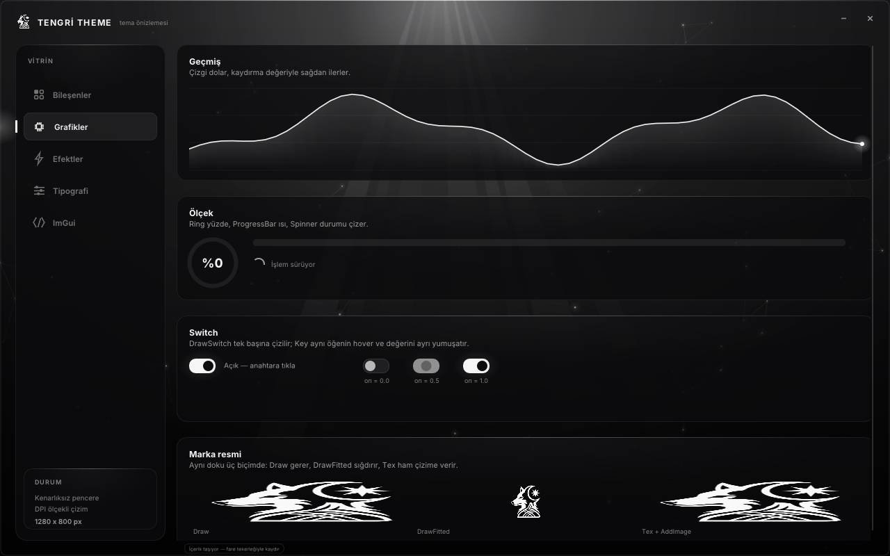
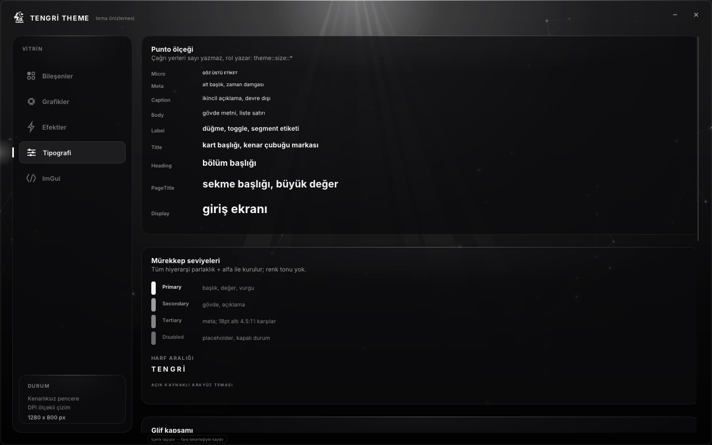
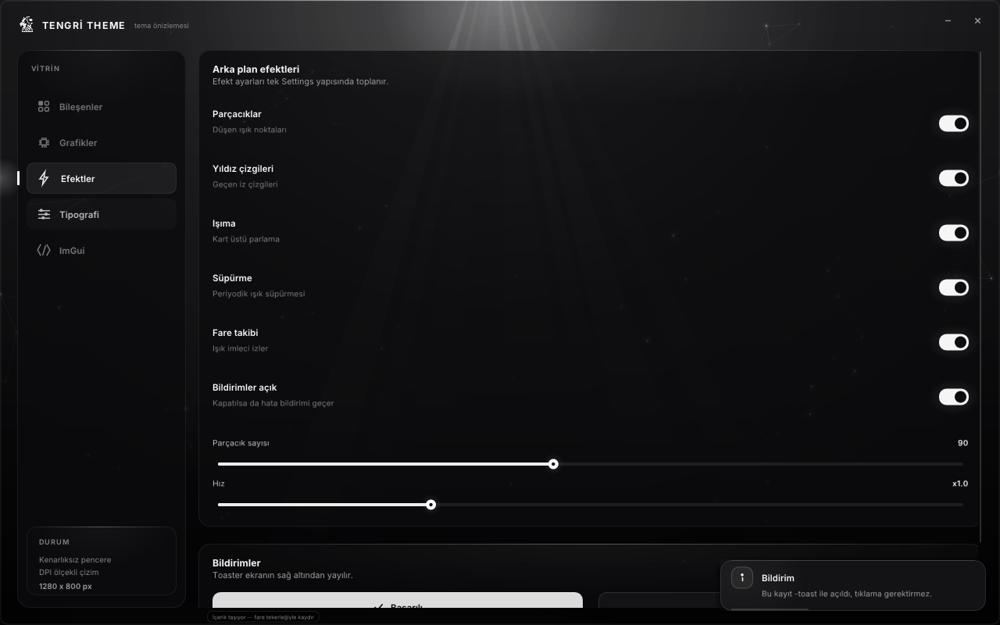
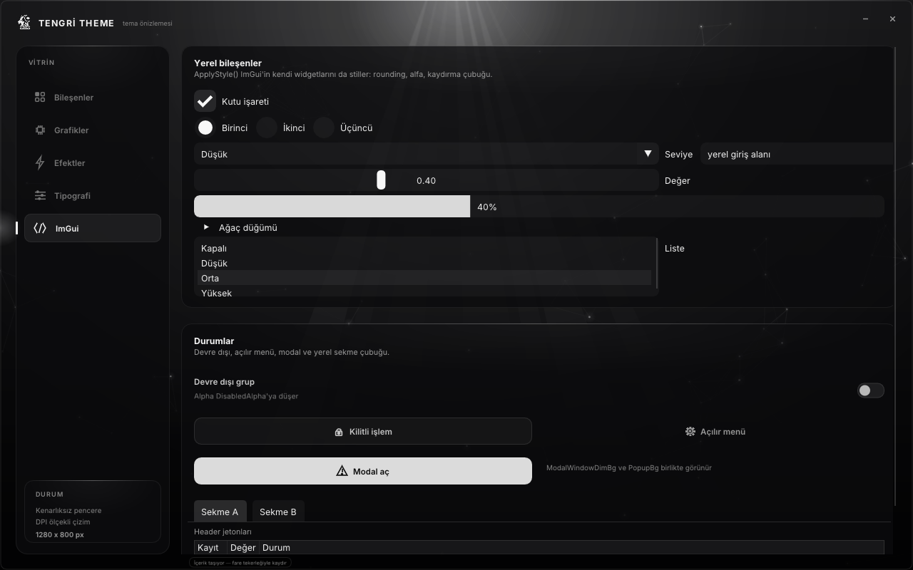
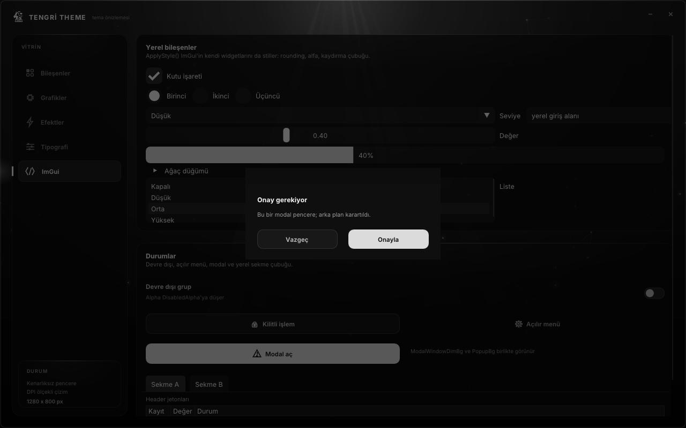
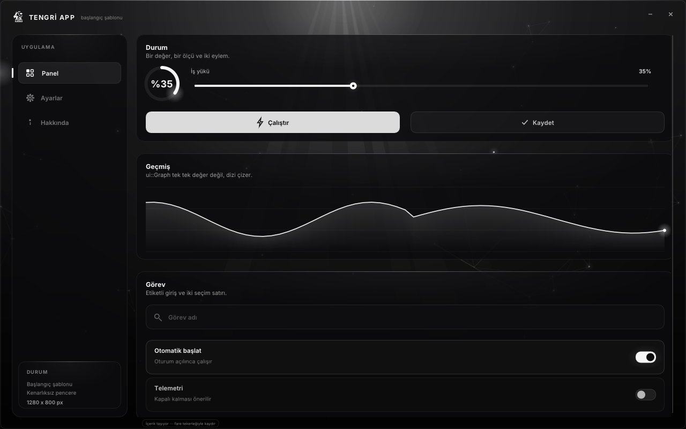
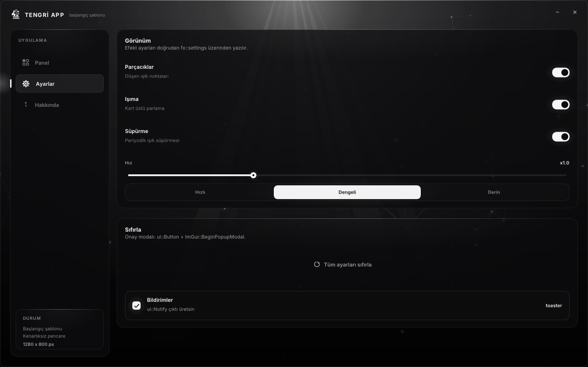
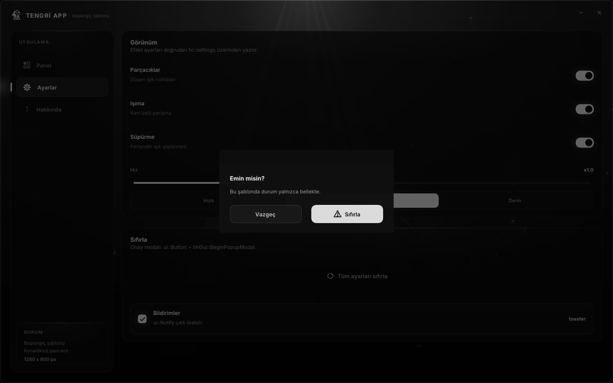

# TENGRİ Theme

Tamamen monokrom (siyah/beyaz) bir Dear ImGui arayüz teması: yazı tipi takımı,
tipografi ve kontrast jetonları, kart yüzeyleri, özel bileşenler, arka plan
efektleri, bildirim katmanı — ve bunların üstünde çalışan bir uygulama kabuğu.
Tema mantıktan bağımsızdır; **depo aynı zamanda kendi uygulamanı yazarak
başlayacağın bir başlangıç şablonudur.**

[](https://github.com/Memati8383/tengri-theme/actions/workflows/build.yml)


<p align="center">
  
</p>

---

## İçindekiler

- [Ekranlar](#ekranlar)
- [Ne var, ne yok](#ne-var-ne-yok)
- [Hızlı başlangıç](#hızlı-başlangıç)
- [Kendi uygulamanı başlat](#kendi-uygulamanı-başlat)
- [Vitrin neyi gösteriyor](#vitrin-neyi-gösteriyor)
- [Bileşen referansı](#bileşen-referansı)
- [Tema jetonları](#tema-jetonları)
- [Vektör ikonlar](#vektör-ikonlar)
- [Arka plan efektleri](#arka-plan-efektleri)
- [Bildirimler](#bildirimler)
- [Marka resmi](#marka-resmi)
- [Uygulama kabuğu: `app::Content`](#uygulama-kabuğu-appcontent)
- [Yerel ImGui widgetları](#yerel-imgui-widgetları)
- [Dört ImGui tuzağı](#dört-imgui-tuzağı)
- [Pencere: kenarlıksız, DPI, boyutlandırma](#pencere-kenarlıksız-dpi-boyutlandırma)
- [Temayı hazır bir projeye taşımak](#temayı-hazır-bir-projeye-taşımak)
- [Testler ve CI](#testler-ve-ci)
- [Sürüm varlıkları ve sağlama](#sürüm-varlıkları-ve-sağlama)
- [Kaynak varlıklarını yenileme](#kaynak-varlıklarını-yenileme)
- [Depo düzeni](#depo-düzeni)
- [Boyama](#boyama)
- [Lisans](#lisans)

---

## Ekranlar

| Vitrin — Grafikler | Vitrin — Tipografi |
|---|---|
|  |  |
| Çizgi grafik, ring, ilerleme çubuğu, spinner, `DrawSwitch` ve marka resminin üç biçimi | Punto ölçeği, mürekkep seviyeleri, Türkçe glifler |

| Vitrin — Efektler + bildirim | Vitrin — yerel ImGui widgetları |
|---|---|
|  |  |
| Üç efekt primitifi, `fx::settings` ve sağ alttaki toaster | checkbox, combo, slider, table, listbox |

| Vitrin — onay modalı | Şablon — Panel |
|---|---|
|  |  |
| `-modal`: karartılmış arka plan, modal içinde yerel ImGui widgetları | `TengriApp.exe`: ölçü + canlı grafik + görev satırları |

| Şablon — Ayarlar | Şablon — onay modalı |
|---|---|
|  |  |
| `ToggleCard`, `Slider`, `Segmented` ile kurulmuş gerçek bir ayar sayfası | `AlwaysAutoResize` modal, karartılmış arka plan |

Tüm görseller `PrintWindow` ile 1280×800 mantıks ölçekte alındı; fare
kullanılmadan gösterilebilen durumlar `-page`, `-size`, `-toast`, `-modal`
bayraklarıyla çağrıldı.

## Ne var, ne yok

**Var**

- Tek renk hücresi olmayan bir hiyerarşi: parlaklık + alfa + boşluk.
- Exe içine gömülü Inter (regular/medium/bold), Türkçe bloğuyla: dosya aramaz.
- `ImDrawList` ile çizilen 31 vektör ikon: ikon fontu, SVG, sprite yok.
- 28 dışa açık çağrıyla özel bileşen seti (düğme, kart, toggle, input, slider,
  segment, ring, graph, spinner, toaster…) ve `ImGuiCol_*` tablosunun **tamamını**
  dolduran bir stil.
- Kenarlıksız ama sürüklenebilir ve kenarından boyutlandırılabilir pencere,
  `WM_DPICHANGED` ölçek taşıması, DWM köşe yuvarlatması (Windows 11) ve
  `SetWindowRgn` yedeği.
- Arka plan efektleri: parçacıklar, yıldız çizgileri, ışıma, periyodik süpürme.
- Üç katmanlı mimari: tema (`src/gui`) → kabuk (`src/app/shell`) → içerik
  (`src/app/my_app.cpp` veya `src/demo.cpp`).

**Yok**

- Uygulama mantığı: registry, temizlik, tray, WinRT toast, ağ. `ui::Notify`
  yalnızca uygulama içi toaster'ı gösterir; Windows bildirimi göndermez.
- Çalışma zamanı DLL'i: `/MT` ile statik bağlanır, tek exe yeter.
- Konfigürasyon dosyası, paket yöneticisi, kurulum adımı.

## Hızlı başlangıç

Hazır yürütülebilir istersen [Releases](../../releases) sayfasından indir:
`TengriApp.exe` (şablon) ve `TengriThemePreview.exe` (vitrin). İkisi de tek
dosyadır; yazı tipi ve marka resmi içine gömülüdür.

Kaynaktan:

```bat
build.bat
build\TengriApp.exe
build\TengriThemePreview.exe
```

veya CMake ile:

```bat
cmake -S . -B build_cmake -G "Visual Studio 17 2022"
cmake --build build_cmake --config Release
ctest --build-config Release --test-dir build_cmake
```

Gereksinim: MSVC araç seti (Build Tools yeterli), Windows SDK, DirectX 11.
Dear ImGui depoda vendor edilmiş olarak gelir (`third_party/imgui`, 1.93.0 WIP /
`IMGUI_VERSION_NUM 19297`); stil `FontSizeBase` ve `FontScaleDpi` alanlarını
kullandığı için **1.92 veya üzeri** gerekir. Ek araç, Python veya paket
yöneticisi gerekmez — `build.bat` yalnızca PowerShell kullanır.

Depo yolu uzunsa `-B` için kısa bir dizin ver (`-B C:\t\tt`). MSBuild, derin bir
yol altında kendi `CMakeScratch\...\*.tlog` dizinini bulamıyor ve derleyici
testini bu yüzden düşürüyor — kodla ilgisi yok, ölçüldü.

İki yürütülebilir aynı çekirdeği linkler; fark yalnızca içerik modülüdür:
`app::content()` ya `src/app/my_app.cpp`'den ya `src/demo.cpp`'den gelir.

## Kendi uygulamanı başlat

`build\TengriApp.exe`yi çalıştır: üç sayfalık boş bir uygulama (Panel, Ayarlar,
Hakkında) görürsün. Kendi uygulamanı yazmak için **tek dosyayı** düzenlersin:
`src/app/my_app.cpp`. Üst bar, kenar çubuğu, sekme göstergesi, kaydırma,
sürükleme, boyutlandırma, bildirimler ve pencere düğmeleri kabukta bir kez
yazılı — şablonla vitrin bunların aynısını paylaşır.

O dosyada üç düzenleme noktası var:

**1) Sayfa tablosu** — kenar çubuğundaki satırlar ve hangi fonksiyonun neyi
çizdiği. Satır ekle, çıkar, sırayı değiştir:

```cpp
const app::Page kPages[] = {
    { "Panel",    Icon::Dashboard, DrawPanel    },
    { "Ayarlar",  Icon::Settings,  DrawSettings },
    { "Hakkında", Icon::Info,      DrawAbout    },
};
```

**2) Sayfa fonksiyonları** — imza `void Draw(float width)`. `width`, kabuğun
verdiği içerik genişliğidir ve kartlara olduğu gibi geçirilir; iç hesap için
`const float inner = w - px(36);` kullanılır:

```cpp
void DrawPanel(float w)
{
    const float inner = w - px(36);
    ui::BeginCard("##card_run", w, "Durum", "Bir değer, bir ölçü ve iki eylem.");
    ImDrawList* dl = ImGui::GetWindowDrawList();      // BeginCard'dan SONRA (tuzak 3)

    ui::Slider("İş yükü", &g_workload, 0.0f, 100.0f, "%.0f%%", inner);
    const ImVec2 bw = ImVec2((inner - px(20)) * 0.5f, px(40));
    if (ui::Button("Çalıştır", bw, ui::ButtonStyle::Primary, Icon::Bolt))
        ui::Notify(ui::Toast::Success, "Çalıştırıldı", kProfiles[g_profile]);
    ui::EndCard();
}
```

**3) `content()`** — kabuğun uygulaman hakkında bildiği her şey:

```cpp
x.brand        = "TENGRİ APP";    // üst bar + pencere başlığı (görev çubuğuna düşer)
x.caption      = "başlangıç şablonu";
x.nav_label    = "UYGULAMA";      // kenar çubuğu bölüm etiketi
x.status_lines = my::kStatus;      // alttaki DURUM kartının satırları (en fazla 3)
x.status_size  = true;             // son satır: canlı "W x H px"
x.begin        = my::Begin;        // ilk karede bir kez
x.tick         = my::Tick;         // her karede, sayfa çizilmeden önce
```

Uygulamanı kendi adınla yayınlamak için:

- **İsim:** `content().brand`ı değiştir (başlık ve görev çubuğu). Dosya adı
  değişmez; onu `build.bat` içindeki `/OUT:build\TengriApp.exe`, CMake'te
  `OUTPUT_NAME "TengriApp"` satırları belirler.
- **Simge:** `main.cpp` `IDI_APPLICATION` kullanıyor; kendi `.ico`nu
  `LoadIconW` yerine bir kaynak simgesiyle değiştir.
- **Vitrini düşür:** `build.bat`'in son `cl` bloğunu ve CMake'teki
  `theme_preview` hedefini sil. Şablon `src/demo.cpp`ye bağlı değildir; o dosya
  yalnızca referans kaynağıdır.
- **Dokunma:** `src/gui/*` (tema), `src/app/shell.*` (kabuk), `src/main.cpp`
  (pencere + DX11 + DPI). Buralara yazdığın her şey vitrinle ortaklaşır.

## Vitrin neyi gösteriyor

Beş sayfa, temada dışarıda kalan tek bir API bırakmıyor. Bu bir iddia değil,
CI'da çalışan bir kapı: `tools/check_showcase.ps1` başlık dosyalarındaki her
public bildirimi toplar ve `src/demo.cpp` ya da `src/app/shell.cpp` içinde
çağrıldığını arar; biri eksikse iş akımı kırmızıya döner. Ölçüm: **48 benzersiz
public sembol, 0 eksik** — sayım, betikten bağımsız ikinci bir çözümleyiciyle de
doğrulandı. Çağrı sayılan metin yorumlardan arındırılır, yani bir sembolü yoruma
yazmak kapıyı geçirmiyor.

| Sayfa | Kapsadığı API |
|---|---|
| Bileşenler | `Button` (3 stil + ikon + yükleniyor hâli), `ToggleCard`, `CheckRow`, `InputField` (normal + `ImGuiInputTextFlags_Password` ve göz/kaçırma), `Slider`, `SliderInt`, `Segmented`, `SectionLabel`, `Label`; kenar çubuğunda `Tab`, `Card`, `Anim`/`AnimSet` ile kayan seçim göstergesi, üst çubukta `IconButton` (tehlike hâli) |
| Grafikler | `Graph` (çizgi + alan dolgusu), `Ring`, `ProgressBar`, `Spinner`, `Text`/`TextSize` ile ölçüye göre hizalama, `DrawSwitch` (canlı anahtar + `on = 0.0/0.5/1.0` ara değerleriyle), `Key`/`Anim` ile hover ve durum yumuşatması, `logo::Draw` / `logo::DrawFitted` / `logo::Tex` + `Ready` üçlüsü |
| Efektler | `fx::settings` alanları: `particles`, `lines`, `glow`, `sweep`, `mouse`, `count`, `speed`; `RadialGradient`, `GradientQuad`, `Shine` primitifleri; `Notify` (4 toast türü), `RenderNotifications`, `notificationsEnabled` köprüsü |
| Tipografi | `theme::size::*` punto ölçeği, `theme::ink::*` mürekkep seviyeleri, `theme::track::*` harf aralığı, `TextSpaced`, `fontdata::kRanges` glif kapsamı (Türkçe bloğu üç yüzde de), `icons::Draw` ile tüm ikon listesi |
| ImGui | `ApplyStyle()` yerel widgetları nasıl boyuyor: checkbox, radio, combo, input, slider, progress bar, tree, listbox, tooltip, popup, modal, tab bar, table, disabled grubu |

Her iki yürütülebilir de aynı dört bayrağı kabul eder — ekran görüntüsü alma ve
doküman için, fareyle tıklama gerektirmezler:

```bat
TengriThemePreview.exe -page 3           :: 0-4, belirli bir sayfayla aç
TengriThemePreview.exe -size 1440x900    :: düzeni başka genişlikte gör
TengriThemePreview.exe -toast 3          :: ilk karede bildirim göster (0-3)
TengriThemePreview.exe -modal            :: onay penceresiyle aç (sayfa 4'e geçer)
TengriApp.exe -modal                     :: şablonun sıfırlama modalıyla aç
```

`-toast` sırası `ui::Toast` enum'ıyla aynı: 0 Başarılı, 1 Bilgi, 2 Uyarı,
3 Hata. `-modal` içeriğe ait bir bayraktır: kabuk onu yalnızca
`Options::modal` olarak iletir, ne yapacağına `content().begin` karar verir.

## Bileşen referansı

Hepsi `src/gui/widgets.hpp` içinde, `ui` ad alanında. Kartlar hariç her bileşen
`float width` ister ve **DPI ölçekli** yüksekliklerle çizilir.

### Yüzeyler

| Çağrı | Ne yapar |
|---|---|
| `BeginCard(id, width, title = nullptr, subtitle = nullptr)` / `EndCard()` | Yüksekliği içeriğe göre büyüyen kart. İçinde akış yerleşimi kullanabilirsin; `title`/`subtitle` boş satırı yönetir |
| `Card(dl, mn, mx, rounding = -1, hover = 0)` | Sabit dörtgene elle çizilen kart yüzeyi (kök pencerede, akışsız düzen için) |

### Denetimler

| Çağrı | Dönüş | Not |
|---|---|---|
| `Button(label, size, style = Primary, icon = None, loading = false)` | `bool` tıklandı | `ButtonStyle::{Primary,Secondary,Ghost}`; `loading` true ise spinner döner ve tıklama yutulur |
| `IconButton(id, icon, size, icon_size, danger = false)` | `bool` | `danger` üstü beyaz dolgu + koyu ikon yapar (kapatma düğmesi) |
| `Tab(label, icon, selected, size)` | `bool` seçildi | Kenar çubuğu satırı; seçili/hover parlaklığı `Anim` ile yumuşatılır |
| `ToggleCard(label, desc, bool* v, width, card = true)` | `bool` değişti | `card=false` düz satır, `true` kutulu satır |
| `CheckRow(label, desc, right, bool* v, width)` | `bool` | Sağda `right` metni (ör. `HKCU`), solda kare kutu |
| `InputField(id, hint, buf, buf_size, icon, reveal, width, flags = 0)` | `bool` değişti | `hint` placeholder (`ink::Disabled`); `reveal` non-null ise göz/kaçırma düğmesi + `ImGuiInputTextFlags_Password` |
| `Slider(label, float* v, vmin, vmax, fmt, width)` | `bool` değişti | `fmt` değere `snprintf` ile uygulanır (ör. `"%.0f%%"`) |
| `SliderInt(label, int* v, vmin, vmax, width)` | `bool` | `Slider`ın tam sayı sarmalayıcısı |
| `Segmented(id, const char* const* items, count, int* current, width)` | `bool` | Tek satırlık dilim seçici |
| `ProgressBar(id, fraction, size)` | — | Tema ilerleme çubuğu (ısı dolgusu); `ImGui::ProgressBar` yerel olanıdır |

### Çizim parçaları

| Çağrı | Not |
|---|---|
| `Ring(dl, center, radius, thickness, fraction)` | Dairesel ölçü |
| `Graph(dl, mn, mx, values, count, vmin, vmax, scroll)` | Çizgi + alan dolgusu; `values` ham dizi |
| `Spinner(dl, center, radius, thickness, col)` | `ImGui::GetTime()` ile döner |
| `DrawSwitch(dl, pos, on, hover)` | Anahtar gövdesi (toggle kartları bunu kullanır) |

### Metin

| Çağrı | Not |
|---|---|
| `Text(dl, font, size, pos, ImU32 col, text)` | `size` **ölçeklenmemiş** puntodur; `theme::size::*` ver |
| `TextSize(font, size, text)` | `ImVec2` — hizalama ve ortalama bundan yapılır |
| `TextSpaced(dl, font, size, pos, col, text, spacing)` / `SpacedSize(...)` | Harf aralığı; `theme::track::*` piksel değeri `px()` ile geçirilir |
| `Label(font, size, float gray, text, alpha = 1)` | Akışa yazar. **Renk değil float bekler** (bkz. jetonlar) |
| `SectionLabel(text)` | Büyük harfli, `track::Micro` aralıklı bölüm etiketi |

### Animasyon

```cpp
float  Anim(ImGuiID id, float target, float speed = 12.0f);  // üstel yumuşatma
void   AnimSet(ImGuiID id, float value);                     // ilk karede atlama
ImGuiID Key(ImGuiID id, const char* suffix);                 // aynı id'nin alt anahtarları
```

Durum ImGui kimliğiyle tutulur, statik tablo yoktur; aynı düğme birden çok
yerde kullanılabilir. `-page 3` ile açılan sekme göstergesinin süzülmemesi
`AnimSet` sayesindedir.

## Tema jetonları

Renkler sabit `ImVec4` listesi değil, gri seviyesi + alfa olarak üretilir:

```cpp
theme::White(alpha)        // beyaz, verilen alfa
theme::Gray(value, alpha)  // value: 0.0 siyah, 1.0 beyaz
theme::Gray(value)
theme::Black(alpha)
```

```cpp
theme::px(18)        // float: DPI ile çarpılmış piksel
theme::px(10, 8)     // ImVec2
theme::scale         // monitör ölçeği (Init'te yazılır)
```

### Punto ölçeği (`theme::size::*`)

Sayı yazılmaz, rol yazılır. Yarım punto adımları kasıtlı: iki değer arasında
seçim yapılamayınca her yeni ihtiyaç yeni bir punto doğurur.

| Rol | Punto | Kullanım |
|---|---|---|
| `Micro` | 8.5 | büyük harfli üst etiketler (`VİTRİN`, `DURUM`) |
| `Meta` | 11 | alt başlık, zaman damgası, kimlik satırları |
| `Caption` | 12 | ikincil açıklama, devre dışı metin |
| `Body` | 12.5 | gövde metni, liste satırı |
| `Label` | 14 | düğme, toggle, segment etiketi |
| `Title` | 15 | kart başlığı, kenar çubuğu markası |
| `Heading` | 18 | bölüm başlığı |
| `PageTitle` | 22 | sayfa başlığı, büyük değer (`%35`) |
| `Display` | 26 | giriş ekranı |

### Mürekkep seviyeleri (`theme::ink::*`)

Oranlar `docs/img/preview-components.png` içinden ölçülen gerçek piksellerle
hesaplandı (WCAG göreli parlaklık, tam alfa varsayımı): kart yüzeyi
`rgb(13,13,14)`, ışıma altında kenar `rgb(23,23,25)`.

| Rol | Değer | Kart üstünde | Işımalı kenarda |
|---|---|---|---|
| `Primary` | 0.96 | 17.8:1 | 16.4:1 |
| `Secondary` | 0.62 | 7.3:1 | 6.7:1 |
| `Tertiary` | 0.52 | 5.2:1 | 4.8:1 |
| `Disabled` | 0.42 | 3.7:1 | 3.4:1 |

Kullanım: `Primary` başlık/değer/vurgu, `Secondary` gövde ve açıklama,
`Tertiary` meta/etiket/zaman damgası, `Disabled` placeholder ve kapalı durum.

18 punto altında WCAG 4.5:1 ister: `Tertiary` iki yüzeyde de geçiyor,
`Disabled` geçmiyor — bu yüzden `Disabled` yalnızca placeholder ve kapalı
durum içindir, bilgi metni için değil. Eşik `0.42` ile `0.48` arasında
(kart zemininde `0.48 → 4.55:1` sınırda, `0.45 → 4.08:1` yetmez). Alfa 1.0'ın
altında çizildiğinde oran tablodakinden daha da düşer.

Bu değerler **float**tır, renk değildir. `ui::Label` float bekler;
`ui::Text`/`TextSpaced` `ImU32` bekler ve `theme::Gray(...)` ile sarmalanmalı.
Çıplak float `ImU32`ye dönüşürse `0.52 → 0` olur: tamamen saydam siyah.
Derleyici uyarmaz, hata da vermez, metin sadece çizilmez.

### Harf aralığı (`theme::track::*`)

`Micro 1.2` (büyük harfli mikro etiketler), `Wide 3.0` (display metni). Piksel
değeri; `px(theme::track::Micro)` ile geçirilir.

## Vektör ikonlar

`icons::Draw(dl, icon, center, size, col, thickness = 0)` — hepsi `ImDrawList`
ile çizilir, ikon fontu gerektirmez. `thickness = 0` boyuta göre otomatik
seçilir; ince işçilik için elle ver (ör. `px(1.5f)`).

`enum class Icon` sırası (vitrinde Tipografi sayfasının altında tek tek gösterilir):

```
Dashboard  Cleaner  Tweaks  Network  Settings  Key      User     Logout
Close      Minimize Check   Eye      EyeOff    Cpu      Memory   Disk
Shield     Bolt     Info    Warning  Error     Alert    Search   Refresh
Monitor    Globe    Lock    Chip     Instagram GitHub   Code     (None)
```

Not: `Info` çıplak bir nokta + çubuktur (daire yok); 16px'lik kenar çubuğu
satırında küçük görünür. `Warning` onun tersidir.

## Arka plan efektleri

Tek gerçek `fx::settings` yapısıdır; uygulama yazar, çizim katmanı okur.

| Alan | Varsayılan | Ne yapar |
|---|---|---|
| `count` | 90 | parçacık sayısı (0-200 arası vitrinde sürgülü) |
| `speed` | 1.0 | genel hız çarpanı |
| `particles` | true | düşen ışık noktaları |
| `lines` | true | geçen yıldız çizgileri |
| `glow` | true | kart üstü ışıma |
| `sweep` | true | periyodik ışık süpürmesi |
| `mouse` | true | ışığın imleci izlemesi |

```cpp
fx::DrawBackground(ImGui::GetBackgroundDrawList(), ImVec2(0,0), io.DisplaySize, 1.0f);
// ... arayüz ...
fx::DrawSweep(ImGui::GetForegroundDrawList(), ImVec2(0,0), io.DisplaySize, 0.5f);
```

İlkel olarak `RadialGradient`, `GradientQuad`, `Shine` de dışarıya açık; tema
düğmeleri ve sekme göstergesi ışımayı bunlarla kuruyor.

## Bildirimler

```cpp
ui::Notify(ui::Toast::Success, "Başlık", "Açıklama");        // isteğe bağlı duration (vars. 3.6s)
ui::RenderNotifications(io.DisplaySize);                      // her karede, ImGui::Render'dan önce
```

`Toast::{Success, Info, Warning, Error}`. Toaster ekranın sağ altından yayılır;
`ui::notificationsEnabled` kapatılsa bile **Error** geçer (kullanıcının
kaçırabileceği tek durum). Windows bildirim kanalı bu pakette bilinçli olarak
yok: her olayın kendi düğmeleri ve hedef sayfası vardır ve bunlar yalnızca
çağıran yerde bilinir.

## Marka resmi

`res/tengri-logo.png` exe içine `RT_RCDATA` olarak gömülür, çalışma anında WIC
ile çözülüp DX11 dokusuna çevrilir — exe tek başına kopyalansa da marka
kaybolmaz.

```cpp
logo::Init(g_device);                 // D3D11 cihazı kurulduktan sonra bir kez
logo::Draw(dl, mn, mx, tint);         // dörtgene doldur
logo::DrawFitted(dl, mn, mx, inset, tint);   // oranı koruyarak sığdır
if (!logo::Ready()) { /* yedeği çiz */ }     // Init başarısızsa çağıran düşer
logo::Shutdown();                     // cihaz kapatılmadan önce
```

`logo.hpp` DX11 başlıklarını ileri bildirir; D3D bilmeyen bir dosya yalnızca
`Draw*` çağırabilir.

## Uygulama kabuğu: `app::Content`

`src/app/shell.hpp` sözleşmeyi, `shell.cpp` uygulamasını tutar:

```
İçerik modülü (my_app.cpp / demo.cpp)
        │  app::content()  — link adımında bağlanır
        ▼
app::Frame()  ── fx arka planı
   ├── ##root (tüm ekran, dekorasyonsuz)
   │    ├── üst bar    : marka + logo + minimize/kapat + sürükleme bölgesi
   │    ├── kenar çubuğu: bölüm etiketi, sayfa satırları, kayan gösterge, DURUM kartı
   │    └── ##content  : kaydırılabilir alt pencere → sayfa fonksiyonun buraya çizer
   ├── kaydırma ipucu  : içerik taştığında, popup yokken
   ├── fx süpürmesi + RenderNotifications + 1px pencere çerçevesi
```

| `Content` alanı | Anlamı |
|---|---|
| `brand`, `caption` | üst bar metni; `brand` ayrıca pencere başlığıdır (görev çubuğu/Alt-Tab) |
| `pages`, `page_count` | kenar çubuğu satırları: `{ label, icon, draw(width) }` |
| `first_page` | `-page` verilmediğinde açılacak sayfa |
| `nav_label` | kenar çubuğu bölüm etiketi (vars. `GEZİNME`) |
| `status_lines`, `status_count` | DURUM kartı satırları; `nullptr`/0 ise kart çizilmez |
| `status_size` | son satır canlı `W x H px` olsun mu |
| `begin(opt)` | ilk karede bir kez; `app::SetPage()` ve `ui::Notify` buradan güvenle çağrılır |
| `tick(now)` | her karede, sayfa çizilmeden önce (veri/animasyon güncelleme) |

Yardımcılar: `app::CurrentPage()`, `app::SetPage(i)`, `app::Hwnd()`,
`app::Corner()`. Kabuk `Options`ı (`start_page`, `toast`, `modal`) komut
satından okur; `modal`ı içeriğe **olduğu gibi** iletir.

## Dört ImGui tuzağı

Tema bu dört davranışı varsayarak yazıldı; kendi projende de aynı hatalar çıkar.

1. **`ImGui::SameLine(x)` boşluk değil, mutlak X'dir** (pencerenin solundan).
   Yan yana iki düğme istiyorsan `ImGui::SameLine(0.0f, px(12))` kullan.
2. **Akış X'i her satırda sıfıra döner.** `ItemSize()`, satır sonunda imleci
   `window->Pos.x + DC.Indent.x` konumuna çeker; temada `WindowPadding = (0,0)`
   olduğu için kök pencerede bu değer pencerenin solu demek. Yani kök pencerede
   `SetCursorScreenPos` yalnızca *o satırı* konumlandırır, sonrakiler sola kaçar.
   Çözüm: her öğeden önce açıkça `SetCursorScreenPos` (bkz.
   `src/app/shell.cpp` içindeki `DrawSidebar`), ya da içeriği `WindowPadding`i
   sıfır olmayan bir alt pencereye al.
3. **Draw list'i `BeginCard`'dan *sonra* al.** `ui::EndCard()` kart yüzeyini üst
   pencerenin çizim listesine yazar ve üst pencere alt pencereden önce render
   edilir. `BeginCard`dan önce yakalanan `ImDrawList*` dolayısıyla kartın
   *arkasına* çizer; içerik görünmez ya da soluk kalır. Her kart için:

   ```cpp
   ui::BeginCard("##card", w, "Baslik", "Aciklama");
   ImDrawList* dl = ImGui::GetWindowDrawList();   // alt pencerenin listesi
   ```

4. **`WindowPadding` bilinçli olarak `(0,0)`.** Kök düzen her öğeyi açıkça
   konumlandırdığı için iç paya ihtiyaç duymuyor; ama aynı stil yerel ImGui
   pencerelerine ve popuplara da yayılıyor. `BeginPopupModal` / `BeginPopup`
   kullanırken boşluğu sen ver, yoksa metin kartın kenarına yapışır:

   ```cpp
   ImGui::PushStyleVar(ImGuiStyleVar_WindowPadding, ImVec2(px(22), px(20)));
   if (ImGui::BeginPopupModal("##modal", nullptr, ImGuiWindowFlags_AlwaysAutoResize)) { /* ... */ }
   ImGui::PopStyleVar();
   ```

   `AlwaysAutoResize`da genişliği içerik belirler; kart genişliğini (`inner`)
   modalın düğmelerine verirsen modal ekranı kaplar.

## Yerel ImGui widgetları

`theme::Init()` yalnızca tema widgetlarını değil, `ImGui::Checkbox`,
`ImGui::ProgressBar`, `ImGui::BeginTabBar`, `ImGui::BeginTable` gibi yerel
widgetları da boyar; bu yüzden `ImGuiCol_*` tablosunun **tamamı** doldurulur
(61 gerçek satır; enumda geriye yalnızca `ImGuiCol_COUNT` sayacı kalır).
Atlanan bir satır ImGuiın varsayılan sarı/mavi rengiyle tek renkli
hiyerarşiyi bozar — ör. `PlotHistogram` yerel ilerleme çubuğunun rengidir.

Tutamaç alfası `White(0.16)`: tema silikliği sever ama `0.10` içerik taşıyan bir
pencerede "kaydırılacak bir şey yok" gibi görünüyor. Kabuk ayrıca taşma varken
alta bir ipucu çiziyor (`ImGui::GetScrollMaxY() > 0`, açık popup yokken).

## Pencere: kenarlıksız, DPI, boyutlandırma

### Kenarlıksız ama yeniden boyutlandırılabilir

`WS_POPUP` tek başına tutamaçsız bir pencere verir; boyutlandırma üç satır
kazanıyor (`src/main.cpp`):

```cpp
WS_POPUP | WS_MINIMIZEBOX | WS_SYSMENU | WS_THICKFRAME   // stil
case WM_NCCALCSIZE: if (wParam) return 0;                // çerçeve istem alanından yemez
case WM_NCHITTEST:  win::HitTestEdge(rc, pt, margin)     // HTLEFT / HTBOTTOMRIGHT ...
```

`WM_NCCALCSIZE`ı yutmazsan kalın çerçeve 8pxlik bir istem payı biçer ve ImGui
çizimi kenarda kesilir. `WM_NCHITTEST`i Win32ye bırakmak, imleç biçimini ve
boyutlandırma döngüsünü elle taklit etmemek demek. Alt sınır
`WM_GETMINMAXINFO` içinde veriliyor (`720x480` mantıks), yoksa düzen negatif
genişliğe düşebiliyor.

Köşe yuvarlatması Windows 11de DWM attribute 33/34 ile; olmayan derlemelerde
`SetWindowRgn(CreateRoundRectRgn(...))` yedeği devreye girer ve `WM_SIZE`de
yenilenmesi gerekir (başarılı çağrıda bölgenin sahipliği sisteme geçer).

### DPI değişimi

Yazı tipleri yalnızca başlangıçta rasterleştirilir. Monitör değişince yeniden
rasterleme yerine ölçek çarpanı taşınır:

```cpp
ImGui::GetStyle().FontScaleDpi *= ratio;
ImGui::GetStyle().ScaleAllSizes(ratio);
```

Bunu iki kez baştan ölçeklersen her taşımada metin büyüyüp küçülür.

### Üst şeritten sürükleme

`px(64)`lik üst şerit sürükleme bölgesidir; ImGuidan önce `IsAnyItemHovered()`
ve `IsAnyItemActive()` kontrol edilir, böylece düğmenin üstünde sürüklemek
pencereyi taşımaz.

## Temayı hazır bir projeye taşımak

Yeni bir uygulama yazıyorsan yukarıdaki şablonu kullan; bu bölüm mevcut bir
projeye *yalnızca temayı* (kabuğu almadan) eklemek için:

1. `src/gui/*` ve `third_party/imgui` klasörünü kopyala.
2. ImGui + Win32 + DX11 bağlamını kurduktan sonra, `ImGui::NewFrame()`den önce:

```cpp
ImGui_ImplWin32_EnableDpiAwareness();
const float scale = ImGui_ImplWin32_GetDpiScaleForMonitor(
    MonitorFromPoint(POINT{0,0}, MONITOR_DEFAULTTOPRIMARY));
theme::Init(scale);          // yazı tipleri + stil
logo::Init(g_device);        // marka dokusu (istersen)
```

3. Her karede:

```cpp
fx::DrawBackground(ImGui::GetBackgroundDrawList(), ImVec2(0,0), io.DisplaySize, 1.0f);
// ... arayüz ...
fx::DrawSweep(ImGui::GetForegroundDrawList(), ImVec2(0,0), io.DisplaySize, 0.5f);
ui::RenderNotifications(io.DisplaySize);
```

4. Kenarlıksız pencere istersen `src/main.cpp` örnek: `WS_POPUP`, DWM köşe
   yuvarlatma, yedek `SetWindowRgn`, üst şeritten sürükleme, `WM_DPICHANGED`
   ölçek taşıması. Üst bar + kenar çubuğu düzenini de istiyorsan
   `src/app/shell.cpp` ve `src/app/shell.hpp` eklentisiz taşınır: tek şart,
   `app::content()`i senin sağlaman.

Tema dosyaları yalnızca `imgui.h`, `imgui_internal.h` ve Windows API'sine
bağlıdır.

## Testler ve CI

```bat
tests\run_tests.bat
```

Vitrinin çizimi elle doğrulanır; ama `WM_NCHITTEST`i fareyle sürükleyerek
doğrulamanın dürüst bir yolu yok. Bu yüzden kenar şeridi hesabı
`src/window_hit.hpp` içinde saf bir fonksiyona çıkarıldı ve `tests/hit_test.cpp`
17 durumla (dört köşe, dört kenar, iç, şerit dışına bir piksel, pencere dışı,
`margin=0`, `margin > yarı pencere`) sabitleniyor. Sıfır dönüş kodu = geçti.
Test başlıksız ve yan etkisizdir; UI'a, ağa veya kullanıcı verisine erişimi yok.

Aynı hedef CMake tarafında `ctest` ile koşuyor. GitHub Actions
(`.github/workflows/build.yml`) `windows-latest` üzerinde beş adımı çalıştırır:
`build.bat`, CMake yapılandırma + derleme + `ctest`, `tests\run_tests.bat`,
`tools\check_showcase.ps1`, `tools\check_text_encoding.ps1`; yürütülebilirleri
artefakt olarak yükler. Derleme `/W4` sıfır uyarı ölçütüyle yapılır.

Vitrin kapsama kapısı ayrıca elle koşulabilir ve tek bir çıktısı var:

```powershell
powershell -NoProfile -File tools\check_showcase.ps1 -List
```

`-List` her public sembolü ve `ok`/`MISS` durumunu yazar; kapı başlık
dosyalarındaki bildirimleri toplar, çağrıyı `src/demo.cpp` + `src/app/shell.cpp`
içinde arar. `Init`/`Shutdown`/`Frame`/`content` gibi yalnızca can döngüsünde
yaşayan dört adın muafiyeti betiğin başında açıkça yazar; geri kalan hiçbir ad
muaf değildir.

İkinci kapı metin kodlamasını denetler:

```powershell
powershell -NoProfile -File tools\check_text_encoding.ps1
```

Her metin dosyasının geçerli UTF-8 olduğunu, iki kez kodlanmış UTF-8 izi
taşımadığını ve `.ps1` dosyalarının BOM ile yazıldığını kontrol eder (bu satır
yazılırken ölçülen: 36 metin dosyası, 0 kusur). Kural boşuna değil: BOM'suz bir
üreteç betiğini PowerShell 5.1 CP1254 okuyor, ürettiği `font_data.cpp` /
`logo_data.cpp` yorum satırları bozuk doğuyordu — üç dosyada tam olarak bu
bulunup düzeltildi.

## Sürüm varlıkları ve sağlama

Release sayfasındaki iki `.exe`, iş akımının **aynı commit**ten çıkan CI
artefaktlarıdır: `gh release create` artefaktı indirdikten sonra yükler, yani
yayınlanan dosyalar `windows-latest` araç setinde üretilir; geliştirme
masasındaki derlemeden elle yüklenmez.

Derleme **aynı araç setiyle** bayt bayt yeniden üretilebilir: linker `/Brepro`
alır, PE başlığındaki `TimeDateStamp` sabitlenir. Ölçüldü — `build/` iki kez
silinip derlendi, iki exe de `cmp` ile birebir aynı çıktı (SHA-256
`TengriApp 5f90019a…`, `TengriThemePreview 3a3e6883…`).

Bu, başka bir makinenin aynı hash'i vereceği anlamına gelmez. Aynı commit'in CI
çıktısı ile yerel çıktı karşılaştırıldı: `TengriApp.exe` aynı boyutta ama
862.208 baytın 786.701'i farklı; vitrin exe'i ise 973.312 bayt, yani yerel
971.264'ten 2.048 bayt büyük. Fark zaman damgasından değil, derleyici sürümünden
kod üretimine kadar uzanan araç seti farkından geliyor.

```bat
certutil -hashfile TengriThemePreview.exe SHA256
```

Sağlama değerleri sürüm notlarında her iki exe için listelenir ve **o sürümün CI
artefaktına** aittir: indirdiğin dosya listeye uyuyorsa yayınlanan commit'in CI
çıktısıdır. Kendi derlemenden aynı hash'i beklemek ancak aynı araç seti
sürümünü kullanıyorsan anlamlıdır.

## Kaynak varlıklarını yenileme

`res/fonts/*.subset.ttf` ve `res/tengri-logo.png` tek kaynak; gömülü tablolar
üretilir:

```powershell
powershell -File tools\make_font_data.ps1
powershell -File tools\make_logo_data.ps1 -WhiteArtwork
```

Bu adım atlanırsa eski `font_data.cpp` / `logo_data.cpp` derlenir ve değişiklik
sessizce yok sayılır. `build.bat` her derlemede bu iki adımı çalıştırır. Inter
alt kümeleme (fontTools/Python) bu depoda değil; alt küme hazırlanmış hâlde
`res/fonts` altında durur, derleme yalnızca PowerShell ister.

Alt kümenin glif kapsamı `fontdata::kRanges` içinde: U+0020–007E, U+00A0–00FF,
U+0100–017F (Türkçe), U+2000–206F. Aralık verilmezse `GetGlyphRangesDefault`
yalnızca Latin-1 kapsar ve ğ/İ/ş kutu olarak çizilir. Oklar (U+2192) **yoktur**.

## Depo düzeni

```
Tengri-Theme/
├── build.bat                 vcvars bul → gömülü varlıkları üret → iki exe linkle
├── CMakeLists.txt            tengri_core (OBJECT) + app_scaffold + theme_preview + hit_test
├── .gitattributes            satır sonu ve ikili dosya politikası (PNG/TTB binary)
├── CHANGELOG.md              sürümler: ne eklendi, ne ölçüldü
├── CONTRIBUTING.md           kapıların yerel karşılığı + üretilen dosyalar kuralı
├── .github/workflows/        build.yml: derleme + ctest + unit test + vitrin kapısı
├── docs/img/                 README ekran görüntüleri
├── res/                      kaynaklar: Inter alt kümesi (3 yüz) + marka PNG'si
├── third_party/imgui/        vendor edilmiş 1.93.0 WIP (yalnızca derlenen dosyalar)
├── tools/                    make_font_data.ps1, make_logo_data.ps1,
│                             check_showcase.ps1, check_text_encoding.ps1
├── tests/                    hit_test.cpp + run_tests.bat
└── src/
    ├── main.cpp              pencere + D3D11 + DPI + resize; içeriği content()den alır
    ├── window_hit.hpp        WM_NCHITTEST kenar hesabı (saf, test edilebilir)
    ├── demo.cpp              tema vitrini: 5 sayfa, tüm public API
    ├── gui/                  TEMA: theme, widgets, icons, fx, logo + üretilen gömülü veriler
    └── app/
        ├── shell.hpp/.cpp    KABUK: üst bar, kenar çubuğu, içerik, bildirim, çerçeve
        └── my_app.cpp        SENİN UYGULAMAN: düzenleyeceğin tek dosya
```

| Dosya | İçerik |
|---|---|
| `gui/theme.hpp/.cpp` | Renk ve tipografi jetonları, `ImGuiStyle` uygulaması, gömülü Inter yükleme, DPI ölçeği |
| `gui/widgets.hpp/.cpp` | Kart, düğme, sekme, toggle, checkbox satırı, input, slider, segment seçici, progress, spinner, ring, grafik, toaster |
| `gui/fx.hpp/.cpp` | Arka plan efektleri: düşen parçacıklar, yıldız çizgileri, ışıma, periyodik süpürme |
| `gui/icons.hpp/.cpp` | `ImDrawList` ile çizilen vektör ikonlar |
| `gui/logo.hpp/.cpp` | Gömülü PNGyi WIC ile çözüp DX11 dokusuna çeviren marka resmi |
| `gui/font_data.*`, `gui/logo_data.*` | Üretilmiş gömülü bayt tabloları — elle düzenlenmez |

## Boyama

Tema bilinçli olarak renksizdir: tek hücresinde bile renk tonu yok, tüm
hiyerarşi parlaklık + alfa + boşluk ile kuruluyor. Kendi projende renk eklemek
istersen tek yer `theme::Init()` içindeki stil uygulaması (theme.cpp) ve
`theme::ink` jetonları.

## Lisans

MIT — bkz. [LICENSE](LICENSE). Üçüncü taraf bileşenlerin lisansları
[NOTICE.md](NOTICE.md) ve `third_party/imgui/LICENSE.txt` içinde kendi
metinleriyle yürürlüktedir (Dear ImGui: MIT; Inter: SIL OFL 1.1).

Sürüm geçmişi [CHANGELOG.md](CHANGELOG.md) içinde, yerelde koşman gereken
kapılar [CONTRIBUTING.md](CONTRIBUTING.md) içinde.
